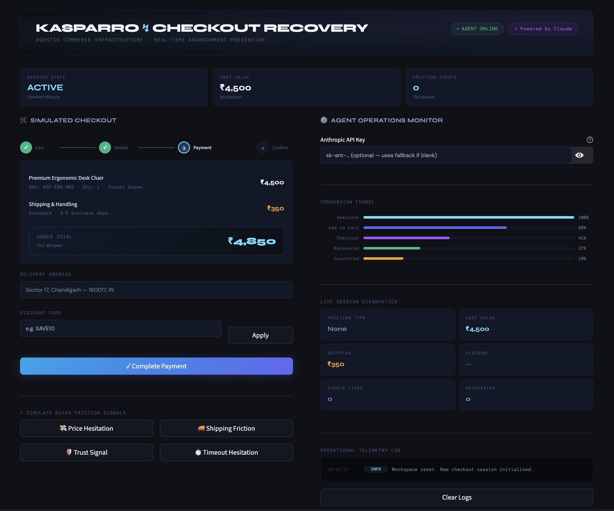

<div align="center">

<br/>

```
██╗  ██╗ █████╗ ███████╗██████╗  █████╗ ██████╗ ██████╗  ██████╗
██║ ██╔╝██╔══██╗██╔════╝██╔══██╗██╔══██╗██╔══██╗██╔══██╗██╔═══██╗
█████╔╝ ███████║███████╗██████╔╝███████║██████╔╝██████╔╝██║   ██║
██╔═██╗ ██╔══██║╚════██║██╔═══╝ ██╔══██║██╔══██╗██╔══██╗██║   ██║
██║  ██╗██║  ██║███████║██║     ██║  ██║██║  ██║██║  ██║╚██████╔╝
╚═╝  ╚═╝╚═╝  ╚═╝╚══════╝╚═╝     ╚═╝  ╚═╝╚═╝  ╚═╝╚═╝  ╚═╝ ╚═════╝
```

### ⚡ AI-Assisted Checkout Recovery · Agentic Commerce Infrastructure

<br/>

[](https://python.org)
[](https://streamlit.io)
[](https://anthropic.com)
[](LICENSE)
[](https://kasparro.streamlit.app)

<br/>

> **$18B lost every day to cart abandonment.**  
> We built the real-time intervention layer that stops it — before the tab closes.

<br/>

[🚀 Live Demo](#-quick-start) · [📐 Architecture](#-system-architecture) · [⚙️ Setup](#%EF%B8%8F-installation) · [📄 Docs](#-documentation)

<br/>



</div>

---

## 🧠 The Problem We're Solving

Cart abandonment is e-commerce's most expensive unsolved problem — with a global average abandonment rate of **~70%**. Current recovery tooling is fundamentally broken:

| Existing Approach | What's Wrong |
|---|---|
| 📧 Abandoned cart emails | Sent **hours after** the session ends — buyer has moved on |
| 💬 Live chat widgets | Require human agents; can't scale to every session |
| 🎯 Generic popups | One-size-fits-all discounts that train buyers to abandon on purpose |
| 📊 Retargeting ads | Expensive, delayed, and context-blind |

**Kasparro's approach is different.** We intercept abandonment signals *mid-session* — within seconds of hesitation — and deploy a context-aware AI agent to resolve the specific friction point before the buyer leaves.

---

## ✨ What This System Does

```
Buyer shows hesitation signal
         │
         ▼
┌─────────────────────────┐
│  Friction Detection     │  ← Telemetry: hover patterns, idle time,
│  Engine                 │    coupon attempts, scroll depth
└────────────┬────────────┘
             │
             ▼
┌─────────────────────────┐
│  Context Assembly       │  ← Cart value, shipping state,
│  Layer                  │    friction type, session history
└────────────┬────────────┘
             │
         ┌───┴───┐
    Key? │       │ No key?
         ▼       ▼
   ┌──────────┐ ┌──────────────────┐
   │ Claude   │ │ Deterministic    │
   │ Sonnet 4 │ │ Rules Engine     │
   └────┬─────┘ └────────┬─────────┘
        └────────┬────────┘
                 ▼
    ┌─────────────────────────┐
    │  Hyper-Personalised     │  ← Delivered inline, zero latency,
    │  Intervention           │    specific discount or reassurance
    └─────────────────────────┘
                 │
                 ▼
         Buyer Converts ✓
```

---

## 🎯 Core Features

### `01` — Real-Time Friction Detection
Four behavioural signals are modelled and intercepted:

| Signal | Behaviour Pattern | Agent Response |
|---|---|---|
| 💸 **Price Hesitation** | Opened coupon field 3×, hovered total 45s | Immediate 10% discount code |
| 🚚 **Shipping Friction** | Toggled delivery options 4×, read policy | Waives shipping fee for the session |
| 🛡️ **Trust Signal** | Navigated to returns page, scrolled twice | Highlights return policy + loyalty offer |
| ⏱️ **Timeout Hesitation** | Idle 90s, cursor drifted to browser close | Urgency nudge with session-locked offer |

### `02` — Contextual AI Interventions
Powered by **Claude Sonnet 4** — not a generic popup, but a message that:
- References the *exact* friction the buyer is experiencing
- Proposes a *specific*, actionable remedy
- Sounds like a helpful human, not a marketing script
- Generates in under 800ms

### `03` — Graceful Degradation Architecture
The system **never fails silently.** If the LLM API is unavailable:

```
LLM Request → Timeout/Error
                    │
                    ▼
        Deterministic Rules Engine
        ┌──────────────────────────┐
        │ friction_type == "Price" │ → RECOVER10 (10% off)
        │ friction_type == "Ship"  │ → FREESHIP (free delivery)
        │ default                  │ → CART5 (5% basket offer)
        └──────────────────────────┘
        Checkout loop: UNBROKEN ✓
```

### `04` — Merchant Operations Monitor
A real-time backend dashboard tracking:
- Live session state machine (`Active → Recovered → Completed`)
- Conversion funnel with drop-off visualization
- Colour-coded telemetry log (`INFO / WARN / SUCCESS / ERROR`)
- Session diagnostics: cart mutations, friction events, recovery count

---

## 📐 System Architecture

```
┌──────────────────────────────────────────────────────────────────┐
│                     KASPARRO RECOVERY STACK                      │
├──────────────────────────────────────────────────────────────────┤
│                                                                  │
│   ┌──────────────────────┐    ┌──────────────────────────────┐  │
│   │   CHECKOUT LAYER     │    │   AGENT OPERATIONS LAYER     │  │
│   │                      │    │                              │  │
│   │  • Order Summary UI  │    │  • Session State Machine     │  │
│   │  • Payment Flow Sim  │    │  • Conversion Funnel Viz     │  │
│   │  • Cart Mutations    │    │  • Telemetry Log Terminal    │  │
│   │  • Coupon Engine     │    │  • Diagnostic Metrics Grid   │  │
│   └──────────┬───────────┘    └──────────────────────────────┘  │
│              │                                                   │
│              ▼                                                   │
│   ┌──────────────────────┐                                       │
│   │  FRICTION DETECTION  │                                       │
│   │  SIMULATION ENGINE   │                                       │
│   │                      │                                       │
│   │  Price · Ship ·      │                                       │
│   │  Trust · Timeout     │                                       │
│   └──────────┬───────────┘                                       │
│              │                                                   │
│       ┌──────┴──────┐                                            │
│       ▼             ▼                                            │
│  ┌─────────┐  ┌───────────────┐                                  │
│  │  Claude │  │  Rules Engine │  ← Fallback, always ready        │
│  │Sonnet 4 │  │  (Hardcoded)  │                                  │
│  └─────────┘  └───────────────┘                                  │
│                                                                  │
└──────────────────────────────────────────────────────────────────┘

Tech Stack: Python 3.9 · Streamlit · Anthropic SDK · dotenv
```

---

## ⚙️ Installation

### Prerequisites
- Python `3.9+`
- An Anthropic API key *(optional — the app runs fully without one)*

### Quick Start

**1. Clone the repository**
```bash
git clone https://github.com/your-username/kasparro-checkout-recovery.git
cd kasparro-checkout-recovery
```

**2. Install dependencies**
```bash
pip install -r requirements.txt
```

**3. Configure environment** *(optional)*
```bash
cp .env.example .env
# Add your key to .env:
# ANTHROPIC_API_KEY=sk-ant-...
```
> 💡 You can also paste your key directly into the UI at runtime. If left blank, the app routes to the deterministic fallback engine automatically — zero setup required.

**4. Launch**
```bash
streamlit run app.py
```

The app opens at `http://localhost:8501`

### Dependencies (`requirements.txt`)
```
streamlit>=1.35.0
anthropic>=0.25.0
python-dotenv>=1.0.0
```

---

## 🖥️ Usage

Once running, the interface has two panels:

**Left — Simulated Checkout**
1. Review the order summary (cart, shipping, total)
2. Click any **friction signal button** to simulate a hesitating buyer
3. Watch the AI agent generate a personalised intervention in real-time
4. Click **Accept Offer** to apply the recovery to the cart
5. Complete payment to record the conversion

**Right — Agent Monitor**
- Paste your Anthropic API key to enable LLM generation
- Watch the telemetry log update live with each event
- Track session state, friction events, and recovery count
- Monitor the conversion funnel across a simulated session cohort

---

## 📁 Project Structure

```
kasparro-checkout-recovery/
│
├── app.py                    # Main Streamlit application
├── requirements.txt          # Python dependencies
├── .env.example              # Environment variable template
│
├── docs/
│   ├── Product_Document.md   # Full product specification
│   ├── Technical_Document.md # Engineering deep-dive
│   └── Decision_Log.md       # Architecture decisions & trade-offs
│
├── screenshot1.png           # UI preview (checkout panel)
└── README.md                 # You are here
```

---

## 📄 Documentation

| Document | Description |
|---|---|
| [`Product_Document.md`](docs/Product_Document.md) | Problem framing, user journey, feature rationale, product roadmap |
| [`Technical_Document.md`](docs/Technical_Document.md) | System architecture, state machine design, API integration, fallback logic |
| [`Decision_Log.md`](docs/Decision_Log.md) | Why Claude over GPT, why Streamlit, trade-offs made under time constraints |

---

## 🗺️ Roadmap

The MVP demonstrates the intervention loop end-to-end. Production would extend this with:

- [ ] **Real telemetry integration** via Shopify Pixel / JavaScript SDK
- [ ] **Behavioural ML model** replacing simulated friction triggers
- [ ] **A/B testing framework** for intervention copy and offer types
- [ ] **Multi-session memory** — recognise returning hesitant buyers
- [ ] **Merchant dashboard** with real conversion lift analytics
- [ ] **WhatsApp / SMS channel** for post-session recovery as secondary layer

---

## 👥 Team

<table>
  <tr>
    <td align="center"><b>Shubhkaram Singh</b></td>
    <td align="center"><b>Gurdarshan Singh</b></td>
  </tr>
  <tr>
    <td>Product logic · Friction trigger design<br/>UI/UX architecture · Documentation</td>
    <td>Engineering · Streamlit state management<br/>LLM integration · Fallback routing</td>
  </tr>
</table>

---

## 📜 License

MIT License — see [`LICENSE`](LICENSE) for details.

---

<div align="center">

<br/>

**Built for the Kasparro Agentic Commerce Hackathon · Track 2**

*Real-time AI recovery. Zero abandonment.*

<br/>

[](https://anthropic.com)
[](https://streamlit.io)

</div>